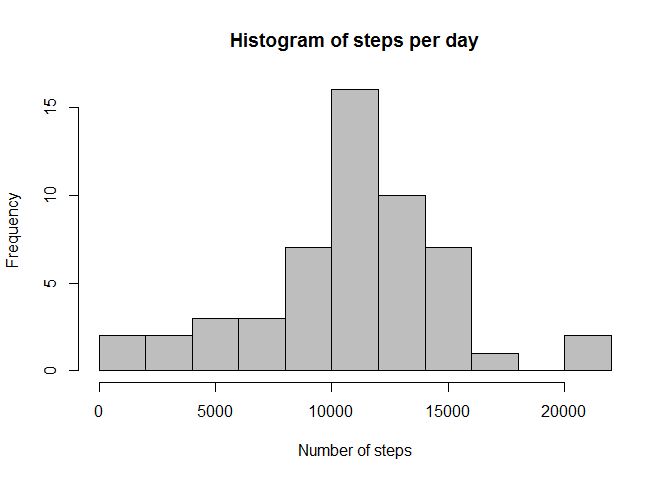
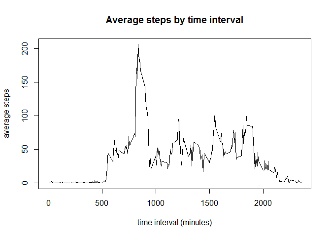
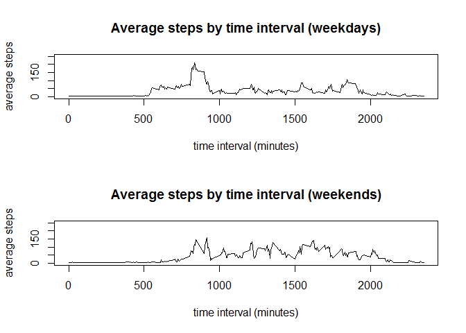

First, let's read in the data file and load the required packages. We will also format the date field into the proper format.


```r
activity <- read.csv("activity.csv")
library(lubridate, lib.loc = "H:/Decision Support/Stats Jam/R files/Libraries")
```

```
## 
## Attaching package: 'lubridate'
```

```
## The following object is masked from 'package:base':
## 
##     date
```

```r
library(knitr, lib.loc = "H:/Decision Support/Stats Jam/R files/Libraries")
activity$date <- ymd(activity$date)
```

Next, we will create a new data frame that aggregates the number of steps taken by day.


```r
dailysteps <- data.frame(aggregate(steps ~ date, activity, sum))
```

Let's build a histogram to view the distribution of daily steps. As can be seen, the data follow roughly a bell-curve shape with some extreme observations at the upper end.


```r
hist(dailysteps$steps, main = "Histogram of steps per day", xlab = "Number of steps", breaks = 10, col = "gray")
```

<!-- -->

Next, we will calculate the mean and median of the daily number of steps.


```r
mean(dailysteps$steps)
```

```
## [1] 10766.19
```

```r
median(dailysteps$steps)
```

```
## [1] 10765
```

Next, we will create a new data frame that aggregates the number of steps taken by time interval.


```r
intervalsteps <- data.frame(aggregate(steps ~ interval, activity, mean))
```

Let's take a look at a line chart to see how the time interval affects the number of steps taken.
  

```r
plot(steps ~ interval, data = intervalsteps, type = "l", main = "Average steps by time interval", xlab = "time interval (minutes)", ylab = "average steps")
```

<!-- -->

Now we can return the time interval with the maximum number of average steps.


```r
intervalsteps$interval[which.max(intervalsteps$steps)]
```

```
## [1] 835
```

We can also count the number of missing values in the dataset.


```r
sum(is.na(activity$steps))
```

```
## [1] 2304
```

Let's remove these NAs. I have decided to populate any missing values with the overall average number of steps during a time interval.


```r
activity$stepsnoNA <- activity$steps
activity$stepsnoNA[is.na(activity$steps)] <- mean(activity$steps, na.rm = TRUE)
activitynoNA <- data.frame(date = activity$date, interval = activity$interval, steps = activity$stepsnoNA) 
dailystepsnoNA <- data.frame(aggregate(steps ~ date, activitynoNA, sum))
```

Let's again look at the histogram of daily steps, but with these missing values populated.


```r
hist(dailystepsnoNA$steps, main = "Histogram of steps per day (replacing NAs with mean)", xlab = "Number of steps", breaks = 10, col = "gray")
```

<!-- -->

Let's also re-calculate the mean and median number of daily steps. Due to the method used, the overall mean is unchanged but the median is slightly higher.


```r
mean(dailystepsnoNA$steps)
```

```
## [1] 10766.19
```

```r
median(dailystepsnoNA$steps)
```

```
## [1] 10766.19
```

Finally, we will create a new data frame to calculate the number of steps based on whether it is a weekday or weekend.


```r
activitynoNA$weekday <- ifelse((weekdays(activitynoNA$date) == "Saturday" | weekdays(activitynoNA$date) == "Sunday") == TRUE, "weekend","weekday")
intervalstepsnoNA <- data.frame(aggregate(steps ~ interval + weekday, activitynoNA, mean))
weekday <- subset(intervalstepsnoNA, weekday == "weekday")
weekend <- subset(intervalstepsnoNA, weekday == "weekend")
```

Here we will set up a panel plot to display number of steps by weekday and weekend. The the top panel shows the average number of steps (per time interval) for weekdays, and the bottom panel shows the same information for weekends.


```r
par(mfrow = c(2,1))
plot(steps ~ interval, data = weekday, type = "l", main = "Average steps by time interval (weekdays)", xlab = "time interval (minutes)", ylab = "average steps", ylim = c(0,250))
plot(steps ~ interval, data = weekend, type = "l", main = "Average steps by time interval (weekends)", xlab = "time interval (minutes)", ylab = "average steps", ylim = c(0,250))
```

<!-- -->
